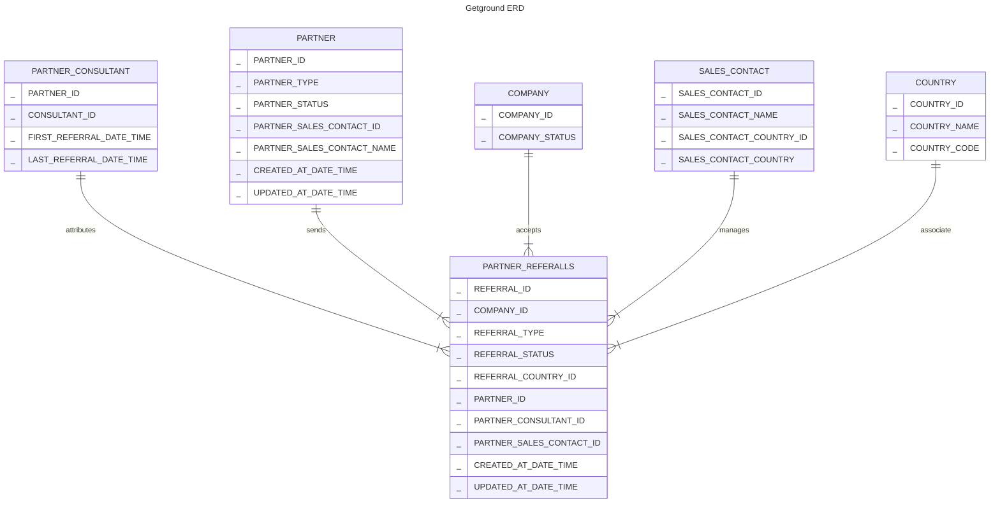

```mermaid
---
title: Getground ERD
---
erDiagram

    PARTNER_REFERALLS {
      _ REFERRAL_ID
      _ COMPANY_ID
      _ REFERRAL_TYPE
      _ REFERRAL_STATUS
      _ REFERRAL_COUNTRY_ID
      _ PARTNER_ID
      _ PARTNER_CONSULTANT_ID
      _ PARTNER_SALES_CONTACT_ID
      _ CREATED_AT_DATE_TIME
      _ UPDATED_AT_DATE_TIME
    }

    PARTNER_CONSULTANT {
      _ PARTNER_ID
      _ CONSULTANT_ID
      _ FIRST_REFERRAL_DATE_TIME
      _ LAST_REFERRAL_DATE_TIME
    }

    PARTNER {
      _ PARTNER_ID
      _ PARTNER_TYPE
      _ PARTNER_STATUS
      _ PARTNER_SALES_CONTACT_ID
      _ PARTNER_SALES_CONTACT_NAME
      _ CREATED_AT_DATE_TIME
      _ UPDATED_AT_DATE_TIME
    }

    COMPANY {
      _ COMPANY_ID
      _ COMPANY_STATUS
    }

    SALES_CONTACT {
      _ SALES_CONTACT_ID
      _ SALES_CONTACT_NAME
      _ SALES_CONTACT_COUNTRY_ID
      _ SALES_CONTACT_COUNTRY
    }

    COUNTRY {
      _ COUNTRY_ID
      _ COUNTRY_NAME
      _ COUNTRY_CODE
    }

    PARTNER_CONSULTANT ||--|{ PARTNER_REFERALLS : attributes
    PARTNER ||--|{ PARTNER_REFERALLS : sends
    COMPANY ||--|{ PARTNER_REFERALLS : accepts
    SALES_CONTACT ||--|{ PARTNER_REFERALLS : manages
    COUNTRY ||--|{ PARTNER_REFERALLS : associate

```