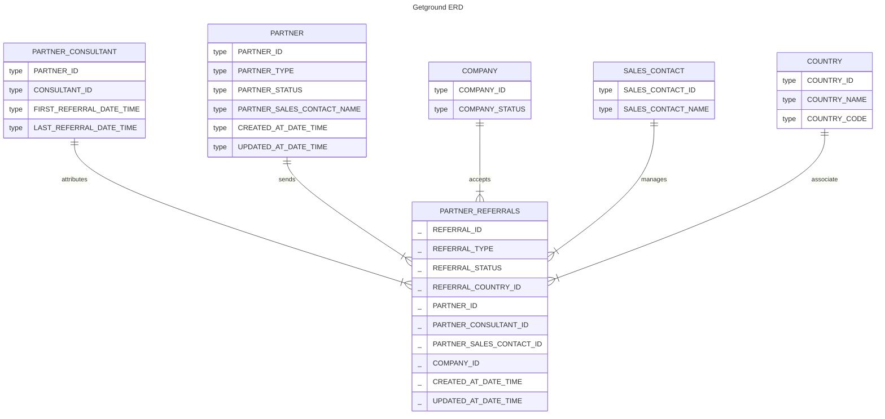

```mermaid
---
title: Getground ERD
---
erDiagram

    PARTNER_REFERRALS {
      _ REFERRAL_ID
      _ REFERRAL_TYPE
      _ REFERRAL_STATUS
      _ REFERRAL_COUNTRY_ID
      _ PARTNER_ID
      _ PARTNER_CONSULTANT_ID
      _ PARTNER_SALES_CONTACT_ID
      _ COMPANY_ID
      _ CREATED_AT_DATE_TIME
      _ UPDATED_AT_DATE_TIME
    }

    PARTNER_CONSULTANT {
      type PARTNER_ID
      type CONSULTANT_ID
      type FIRST_REFERRAL_DATE_TIME
      type LAST_REFERRAL_DATE_TIME
    }

    PARTNER {
      type PARTNER_ID
      type PARTNER_TYPE
      type PARTNER_STATUS
      type PARTNER_SALES_CONTACT_NAME
      type CREATED_AT_DATE_TIME
      type UPDATED_AT_DATE_TIME
    }

    COMPANY {
      type COMPANY_ID
      type COMPANY_STATUS
    }

    SALES_CONTACT {
      type SALES_CONTACT_ID
      type SALES_CONTACT_NAME
    }

    COUNTRY {
      type COUNTRY_ID
      type COUNTRY_NAME
      type COUNTRY_CODE
    }

    PARTNER_CONSULTANT ||--|{ PARTNER_REFERRALS : attributes
    PARTNER ||--|{ PARTNER_REFERRALS : sends
    COMPANY ||--|{ PARTNER_REFERRALS : accepts
    SALES_CONTACT ||--|{ PARTNER_REFERRALS : manages
    COUNTRY ||--|{ PARTNER_REFERRALS : associate

```